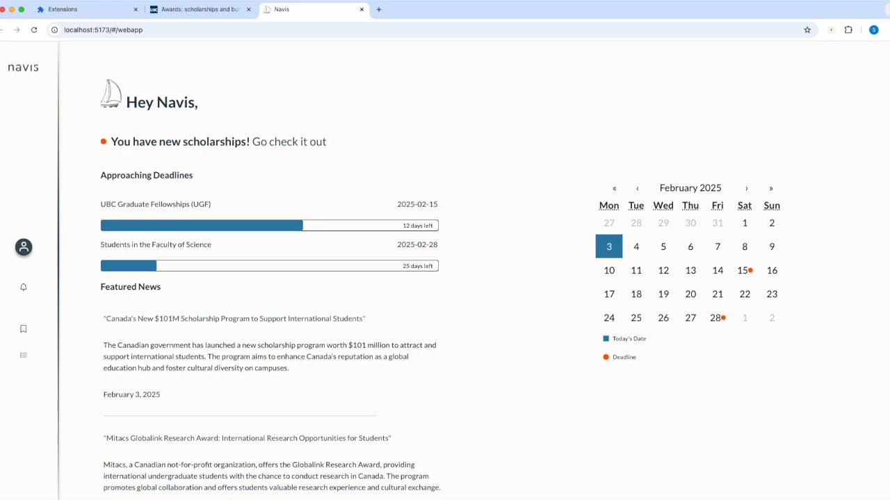

# Navis

Navis is a Chrome extension that helps users find scholarships that are the right fit for them efficiently using features that leverage AI and LLMs. It provides an easier way for students to navigate the numerous scholarships available in a centralized platform, where they can save, apply, and keep track of scholarships they are interested in.

## Tech Stack

The tech stack includes React, TypeScript, and Vite for front-end development, Cohere Command R to retrieve the summarized scholarship information, Node.js and PostgreSQL for server development and integration with the database using REST API endpoints, and Figma and HTML/CSS to integrate UX designs.

## Demo

UX Designer: Rosie Jeon\
LinkedIn: https://www.linkedin.com/in/rosiejeon/

  

